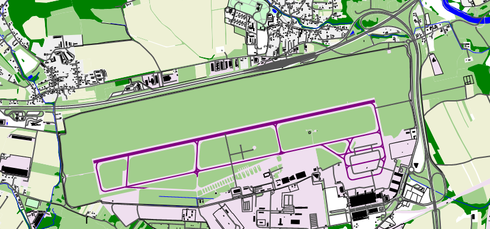
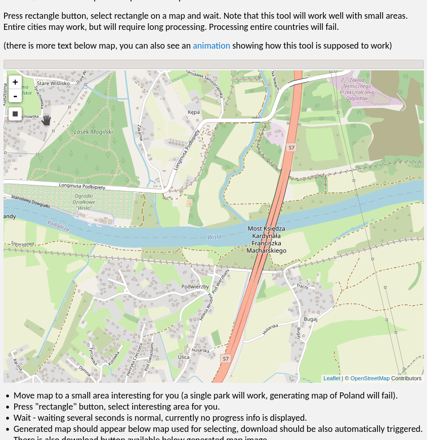
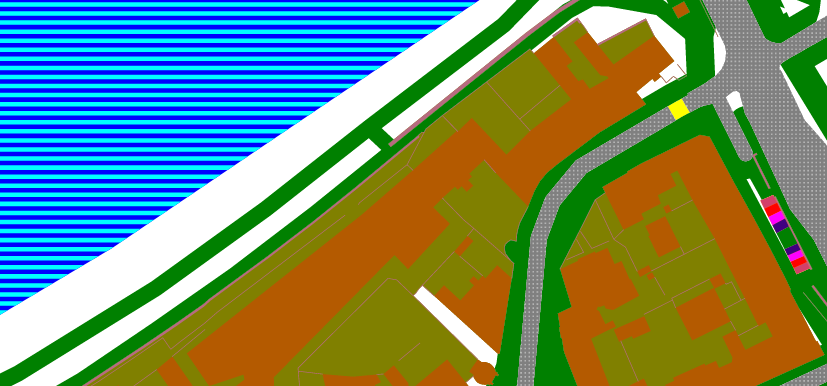

# Lunar assembler

SVG maps from OpenStreetMap data in browser, can be used by marking area on a map. Using it does not require any programming skills.

## In action

### General high zoom map style

[try it!](https://mapsaregreat.com/osm_to_svg_in_browser/)

### Generating design for laser cut tactile maps

## More basic info

Creating own map style will require some abilities but it should be still relatively simple.

Fully functional example is at [mapsaregreat.com/osm_to_svg_in_browser/](https://mapsaregreat.com/osm_to_svg_in_browser/)

Lunar assembler is (1) a JS library allowing easy setup of static websites allowing this (2) set of static sistes demonstrating how it can be used.

Code used to run mentioned example can be found in example folder.

## Published styles

Demonstration of [basic high-zoom map style](https://matkoniecz.github.io/lunar_assembler/examples/general_high_zoom.html)

[Map style classifying areas into public and private](https://matkoniecz.github.io/lunar_assembler/examples/public-vs-closed-areas.html). Done using as data fences, walls, footways and roads mapped in OpenStreetMap.

### For making 3D tactile maps for blind

This map styles are designed for used in a laser cutter, to produce maps for blind.

[Ultra-high zoom map for showing a single crossing](https://matkoniecz.github.io/lunar_assembler/examples/laser_road_crossing_closeup.html), relying on area:highway

[high zoom map style for showing neighbourhood, with some attempts to automatically simplify data, no need for area:highway](https://matkoniecz.github.io/lunar_assembler/examples/laser_neighbourhood.html)

#### Laser cut 3D tactile map

<!--section above is linked from external document, try to keep the tile -->

3D tactile map for blind children. Teaching aid for orientation lessons - special subject where children learn how to move on their own across the city. This is a map of a specific crossing, nearby their school. Made using this project, this propotype was donated to the school.

Cut using file generated by [map style shown in the section above](https://matkoniecz.github.io/lunar_assembler/examples/laser_road_crossing_closeup_map_style.html).

 

## Architecture

It works in following way

- user selects an area
- Overpass API is called to download OpenStreetMap data in that area
- data is locally processed and rendered

it means that servers only delivers HTML site, code then runs on client. It still needs access to Overpass API but there are generously provided servers allowing some limited use.

### Use on other sites

[current release and (for now only known use of it)](https://mapsaregreat.com/osm_to_svg_in_browser/)

## How can I use it on my site?

This work is AGPL licensed. This means that you also can use it, with requirement to share your improvements (see license for the full info, this is a single-sentence summary).

[examples](examples) folder contains files necessary to use that in you project:

- `lunar_assembler.dist.js` (build .js file containing all necessary JS code)
- `lunar_assembler.dist.css` (build .js file containing all necessary CSS code)
- `high_zoom_map_style.js` (map style used in my example, you can build on it or make your own)
- `dev.html` (example usage of `lunar_assembler`, using that map style)

Feel free to use it in your own projects or build on it!

Pull requests with improvements are also welcomed!

## How can I make own map style?

Map style can be quite simple - just setting colors for lines/areas.

In some cases one needs to somehow deals with layers. For example, what should be displayed if road in tunnel goes under building? Or under forest? What should be shown if there is a lake in a forest?

The most complex part of default map style is dealing with layers.

Map styles also have access to a powerful functionality allowing complete rewriting of geometries, what is necessary to implement some functionality but typically can be ignored.

### Help!

Note: especially this part of documentation is incomplete and would benefit from better info. Please open an issue and mention what is confusing and where you are stuck. Right now I am not entirely sure what kind of knowledge people using it will have and what and how should be explained.

## Potential uses

SVG files may be much more accessible for futher processing than alternatives formats of OSM data.

SVG files may be directly usable for some purposes, for example in laser cutters.

## Mentions of use are welcome

In case that you used this code or it inspired you to do something - feel free to create an issue with photo/description of what was produced! Or send an email to [matkoniecz@tutanota.com](mailto:matkoniecz@tutanota.com). It would be nice to have confirmation that publishing it was useful for somebody.

## Improving documentation

Please create a new issue if you want to use it but current instructions are insufficient, wrong or can be in some way improved!

I know that documentation may be far better, but I am not sure what kind of additional documentation would be most useful.

## Alternatives

As usual [OSM Wiki documentation](https://wiki.openstreetmap.org/wiki/SVG#Ways_to_create_an_SVG_map_from_OpenStreetMap) is useful.

## Skipped and rejected features

Note that it is basically impossible to make SVGs that would qualify as high-quality cartography here. As reason why this project exists does not require it (generation of laser cutter designs) it was not considered during design and implementation. But feel free to open issues and create pull requests to add missing functionality!

### Example map style

Exact duplicates of more popular standard tags will not be supported (for example `landcover=water` or `landcover=trees`).

`landuse=reservoir`, `landuse=depot` will not be supported due to being a bad tagging schemes.

Note that making own website with own map style should be relatively easy and anyone interested is able to make their own map style.

Please open an issue if you wanted to do this but you are stuck.

## Sponsors

 

The [OpenStreetMap foundation](https://wiki.osmfoundation.org/wiki/Main_Page) was funding the development of this project in their first round of the [microgrant program](https://wiki.osmfoundation.org/wiki/Microgrants) in 2020. It was done as part of making [tactile maps based on OpenStreetMap data, for blind or visually impaired children](https://wiki.openstreetmap.org/wiki/Microgrants/Microgrants_2020/Proposal/Tactile_maps_for_blind_or_visually_impaired_children) (part of making used tools accessible to other and OpenStreetMap promotion).

If anyone else is also interested in supporting this project via funding - [let me know](mailto:osm-messages@etutanota.com) (opening a new issue is also OK) and it is likely that some way of doing that can be found :)
